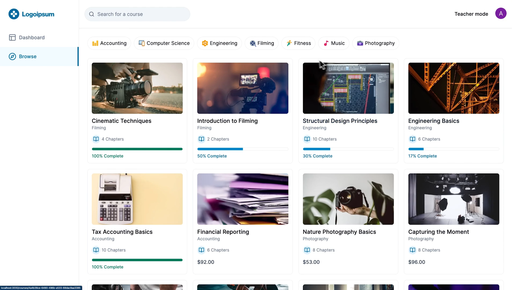
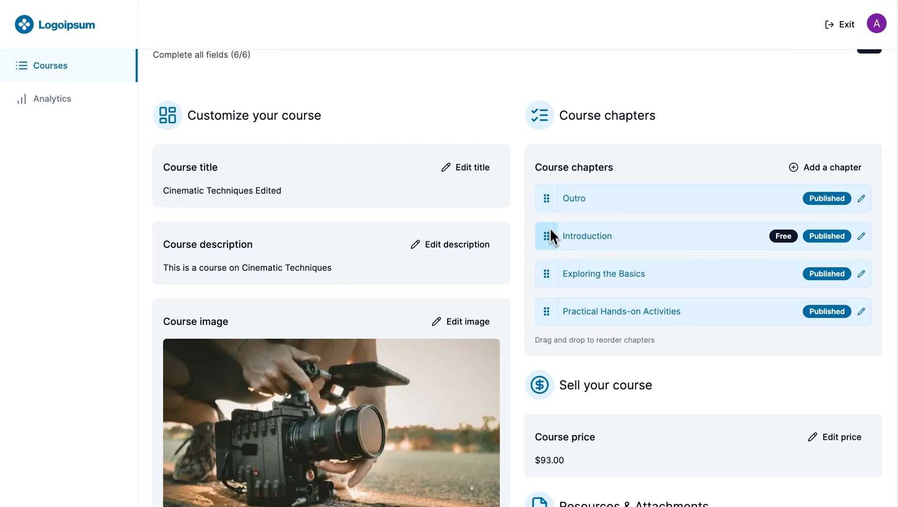

# lms-platform

It is a LMS (Learning Management System) platform in which one can create courses and chapters and it is accessible in the UI for learning purpose.

**Tech Stack:**

- Next js
- Shadcn UI
- tailwind CSS
- Clerk
- Prisma
- MySQL

## Running the Application

Install the dependencies

```bash
npm i
```

Running the UI, it will be accesible at `localhost:3000`

```bash
npm run dev
```

**Application UI will look like this**






**Key Features:**

- Browse & Filter Courses
- Purchase Courses using Stripe
- Mark Chapters as Completed or Uncompleted
- Progress Calculation of each Course
- Student Dashboard
- Teacher mode
- Create new Courses
- Create new Chapters
- Easily reorder chapter position with drag n’ drop
- Upload thumbnails, attachments and videos using UploadThing
- Video processing using Mux
- HLS Video player using Mux
- Rich text editor for chapter description
- Authentication using Clerk
- ORM using Prisma
- MySQL database using Planetscale
